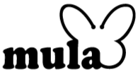

<div align="center">
  
  <h1>Mula Official Brand Website</h1>
  <p>
    <b>The Premium Baby Bedding Brand for the Most Comfortable Sleep 🌙</b>
  </p>

  [](https://nextjs.org/)
  [](https://reactjs.org/)
  [](https://vercel.com/)
  [](#)
</div>

<br/>

## 📖 Overview

**Mula (뮤라)** is a premium baby bedding brand backed by 40 years of textile engineering experience since 1983. This repository contains the source code for Mula's official corporate and product showcase website, fully migrated to a high-performance **Next.js (App Router)** architecture. 

The project emphasizes pristine Search Engine Optimization (SEO), ultra-fast image loading, and a visually stunning "Premium Cinematic" aesthetic tailored for brand storytelling.

## ✨ Key Features

- **Cinematic Hero Design**: Full-width parallax image banners and meticulous typographical spacing.
- **Dynamic Content Routing**: Cleanly separated architecture for `Guide`, `QnA`, `News`, and `Contact` pages.
- **Advanced SEO Optimization**: Built-in JSON-LD structured data for FAQ and Organization schemas, ensuring top-tier AI search visibility.
- **Responsive Layout**: Fluidly adapts down to mobile environments with zero layout shift (`word-break: keep-all`).
- **Brand Identity Highlighting**: Specialized auto-highlighting script parser automatically tracking and styling the '뮤라' keyword across textual content.

## 🛠️ Tech Stack

- **Framework**: [Next.js (App Router)](https://nextjs.org/)
- **Library**: [React 19](https://reactjs.org/)
- **Styling**: Vanilla CSS with customized variable token systems (`globals.css`)
- **Deployment**: [Vercel](https://vercel.com/) Edge Network

## 🚀 Quick Start

First, clone the repository and install the dependencies:

```bash
git clone https://github.com/mminsushin/mula.git
cd mula
npm install
```

Start the development server:

```bash
npm run dev
```

Open [http://localhost:6001](http://localhost:6001) with your browser to instantly view the result.

## 📂 Folder Structure

```css
mula/
├── public/                 
│   └── assets/             # Brand images, hi-res product photos, icons
├── src/                    
│   ├── app/                # Next.js App Router structure (Home, Guide, News, QnA)
│   ├── components/         # Reusable React components (Header, Footer, QnaList)
│   └── globals.css         # Global design tokens and root styles
├── next.config.mjs         # Next.js compiler settings
└── package.json            # Project dependencies and scripts
```

## 📜 License

This project is licensed under the MIT License - see the LICENSE file for details.

---

> Crafted carefully for the perfect sleep. © 2024 Pungjeon T.T All rights reserved.
